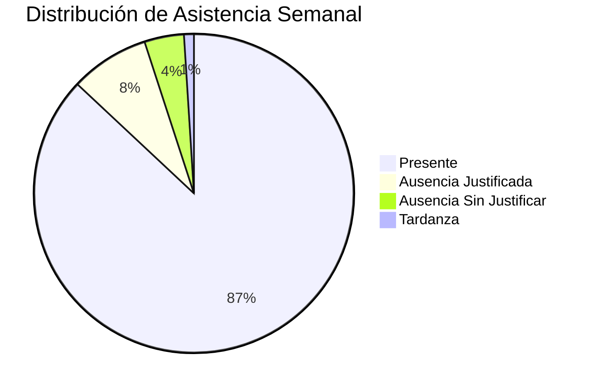

---

## `modulos/dashboard.md`

```markdown
# Módulo Dashboard

El **Dashboard** es el panel principal donde el usuario visualiza información de rendimiento, asistencia y calificaciones.

---

## Widget de asistencia


```mermaid
%%{init: {'xyChart': {'width': 700, 'height': 400}}}%%
xychart-beta
    title "Distribución de Notas por Curso"
    x-axis ["1º ESO", "2º ESO", "3º ESO", "4º ESO", "1º Bach", "2º Bach"]
    y-axis "Nota Media" 0 --> 10
    bar [7.2, 7.5, 7.1, 6.8, 8.1, 8.4]
